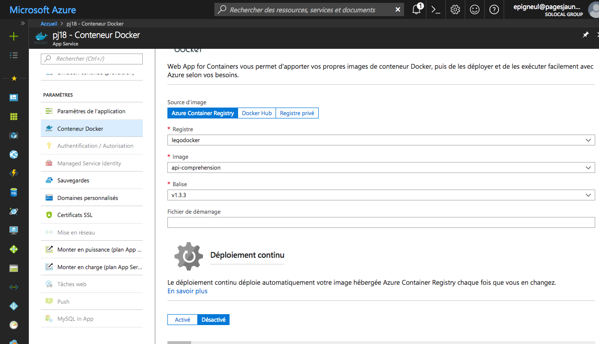

# Présentation
L'api comprehension permet d'interroger le modèle pj18 pour extraire les entités d'une phrase.

# Pré requis
Python 3.5+

# Installation

```
> pip install -r requirements.txt
> git clone https://github.com/facebookresearch/fastText.git
> cd fastText
> pip install .
> cd ..
```

# Déploiement Docker
Le projet contient un fichier de conf pour construire une image Docker.

Basé sur le tuto : https://docs.microsoft.com/fr-fr/azure/app-service/containers/tutorial-custom-docker-image

modifier la version dans conf/api-conf.yml

construire l'image docker
```
> docker build --tag api-comprehension:v1.5.0 .
```

vérifier que l'image fonctionne
```
> docker run -p 2222:9090 api-comprehension:v1.5.0
```

se connecter sur le repo azure
```
> az acr login --name legodocker
```

pousser l'image
```
> docker push legodocker.azurecr.io/api-comprehension:v1.5.0
```

changer le tag de version de container dans azure


Le déploiement prend environ 10 minutes.
Pour tester, faire https://pj18.azurewebsites.net/api-comprehension-1/supervision
on doit constater la bonne version de l'api.
